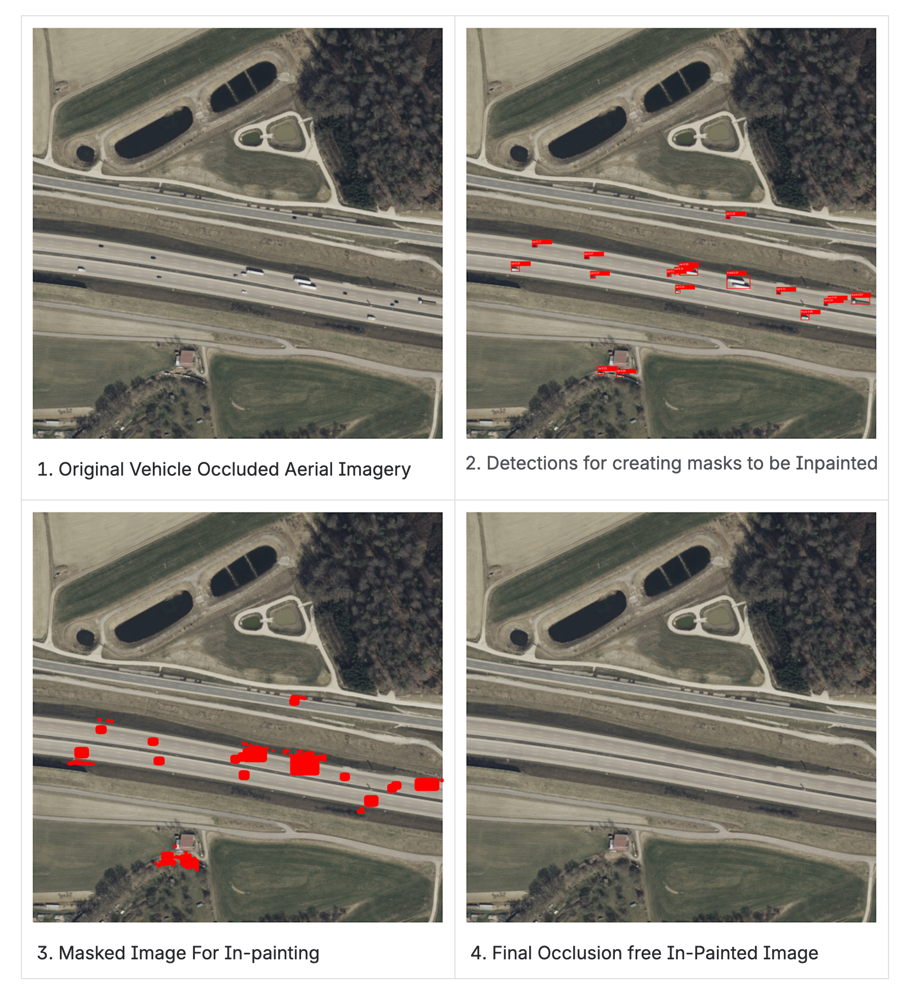

# Stable Diffusion : Inpainting Vehicle Occlusions On Aerial Imagery Road Surfaces


---

## Overview

This pipeline solves a critical problem in aerial road segmentation: **vehicles occlude the road surface**, causing downstream segmentation models (e.g. SAM) to produce fragmented, incomplete road segments. By detecting and inpainting vehicles directly on the aerial image, we produce a clean road surface that yields continuous, accurate segmentation.

---

## Problem Statement

Given an aerial image `I ∈ R^(H×W×3)`, vehicles on the road surface introduce occlusions that break road continuity. The goal is to produce a clean image `I' ∈ R^(H×W×3)` such that:

```
I'(p) = f_inpaint(p)    if p ∈ M
I'(p) = I(p)            if p ∉ M
```

Where `M ⊂ {0,...,H-1} × {0,...,W-1}` is the binary vehicle mask and `f_inpaint` is the generative inpainting function. The constraint `I'(p) = I(p) ∀ p ∉ M` is enforced at the pixel level and verified by the metrics module.

---

## Architecture

```
input_aerial.png
       │
       ▼
┌─────────────────────────────────────────────────────────┐
│  Stage 1: Multi-Scale Tiled Detection  (detection.py)   │
│  YOLOv8n  ×  3 confidence passes  ×  3 tile scales      │
│  → Non-Maximum Suppression                              │
│  → Size + Aspect Ratio Filtering                        │
└─────────────────────┬───────────────────────────────────┘
                      │  detections: List[{x1,y1,x2,y2,conf,label}]
                      ▼
┌─────────────────────────────────────────────────────────┐
│  Stage 2: Mask Construction            (masking.py)     │
│  Vehicle bounding box mask  +  Shadow mask              │
│  → Morphological dilation                               │
│  → Bitwise OR combination                               │
└─────────────────────┬───────────────────────────────────┘
                      │  M: np.ndarray (H×W, uint8)
                      ▼
┌─────────────────────────────────────────────────────────┐
│  Stage 3: Tiled SD Inpainting          (inpainting.py)  │
│  runwayml/stable-diffusion-inpainting                   │
│  → 512×512 tiles with 64px overlap                      │
│  → Only masked pixels replaced                          │
└─────────────────────┬───────────────────────────────────┘
                      │  I': clean aerial image
                      ▼
┌─────────────────────────────────────────────────────────┐
│  Stage 4: Pixel Integrity Verification (metrics.py)     │
│  ∀ p ∉ M : I'(p) = I(p)                                 │
│  → PASS / FAIL report with diff statistics              │
└─────────────────────────────────────────────────────────┘
                      │
                      ▼
              output_inpainted.png
```

---

## Deep Dive

### Stage 1 — Multi-Scale Tiled Vehicle Detection

Standard object detectors fail on high-resolution aerial imagery because:
1. The image resolution (1680×1682) far exceeds the model's native input size (640×640)
2. Vehicles appear at varying scales depending on altitude
3. A single confidence threshold misses low-contrast vehicles (dark cars, shadows)

**Tiling Strategy**

The image is partitioned into overlapping tiles at three scales `S ∈ {512, 640, 800}`. For each dimension `d` and tile size `s`, tile origins are:

```
T(d, s, o) = { t : t = k(s - o), k = 0,1,2,... } ∪ { max(0, d - s) }
```

where `o = 120` is the overlap in pixels. Overlap ensures vehicles at tile boundaries are fully captured in at least one tile.

**Iterative Confidence Passes**

Three detection passes are run at confidence thresholds `C = {0.20, 0.10, 0.05}`. Lower thresholds recover low-contrast vehicles (dark cars, vehicles in shadow) that are missed at higher thresholds. All raw detections across all passes and scales are pooled before NMS.

**Non-Maximum Suppression**

Standard greedy NMS with IoU threshold `τ = 0.25`:

```
IoU(A, B) = |A ∩ B| / |A ∪ B|

Keep box i if:  IoU(box_i, box_j) ≤ τ  for all j with score_j > score_i
```

**False Positive Filtering**

Two geometric filters eliminate non-vehicle detections (buildings, rooftops):

```
Area filter:    α_min · (H·W) ≤ area(box) ≤ α_max · (H·W)
                α_min = 5×10⁻⁶,  α_max = 2×10⁻³

Aspect filter:  1.20 ≤ width/height ≤ 5.0
```

The aspect ratio lower bound of 1.20 is derived empirically: all confirmed vehicles have aspect ≥ 1.24, while building rooftops tend toward square (aspect ≈ 1.0). The area upper bound of 0.002 × image_area = 5,651 px eliminates large non-vehicle structures while retaining the largest real vehicle (5,280 px).

---

### Stage 2 — Binary Mask Construction

**Vehicle Mask**

Each detection bounding box is rasterised into a binary mask, then morphologically dilated with an elliptical structuring element of radius `r = 12` px to cover vehicle edges and bodywork that extend beyond the tight bounding box:

```
M_vehicle = Dilate(⋃ᵢ Box(dᵢ), SE(r=12))
```

**Shadow Mask**

Cast shadows are detected within a constrained search zone around each vehicle. For detection `dᵢ` with box `(x₁,y₁,x₂,y₂)`, the search zone is expanded by `e = 35` px:

```
Z_i = [x₁-e, x₂+e] × [y₁-e, y₂+e]
```

Within `Z_i`, pixels satisfying the dark pixel condition are classified as shadow:

```
shadow(p) = 1  if  R(p) < θ  ∧  G(p) < θ  ∧  B(p) < θ
shadow(p) = 0  otherwise

where θ = 65
```

This strictly limits shadow detection to vehicle-adjacent regions — road markings and other dark features elsewhere in the image are never touched.

**Combined Mask**

```
M = Dilate(M_vehicle, SE(r=6)) ∪ Dilate(M_shadow, SE(r=6))
```

---

### Stage 3 — Tiled Stable Diffusion Inpainting

**Model**

`runwayml/stable-diffusion-inpainting` — a fine-tuned variant of Stable Diffusion v1.5 trained specifically for inpainting tasks. The model operates in latent space via a VAE encoder/decoder with a masked UNet denoising backbone.

**Tiled Inpainting**

The full-resolution image cannot be processed in a single forward pass (native resolution: 512×512). Tiles of size 512×512 with 64 px overlap are processed independently:

```
For each active tile T_{y,x}  (tiles where M ∩ T_{y,x} ≠ ∅):
    result = SD_inpaint(I[T_{y,x}], M[T_{y,x}], prompt, steps=35, cfg=7.5)
    I'[T_{y,x}][M[T_{y,x}] > 0] = result[M[T_{y,x}] > 0]
    I'[T_{y,x}][M[T_{y,x}] = 0] = I[T_{y,x}][M[T_{y,x}] = 0]   ← unchanged
```

The pixel-level copy ensures non-masked pixels are **never** touched, even within active tiles.

**Prompt Engineering**

```
Positive: "aerial top-down satellite view of empty asphalt road,
           clean road surface, road markings, no vehicles,
           uniform tarmac texture, photorealistic"

Negative: "cars, trucks, vehicles, people, shadows,
           blurry, distorted, artifacts"
```

Classifier-Free Guidance scale `w = 7.5` balances prompt adherence against image fidelity.

---

### Stage 4 — Pixel Integrity Verification

The metrics module computes a pixel-level diff between the original and inpainted images:

```
D(p) = |I'(p) - I(p)|₁   (L1 per-pixel difference, summed over channels)

Integrity condition:  D(p) = 0  ∀ p ∉ M
```

A **PASS** result mathematically proves that the inpainting operation was perfectly contained within the vehicle mask.

---

## Repository Structure

```
.
├── main.py          Entry point. Orchestrates the full pipeline.
├── config.py        All tunable parameters in one place.
├── detection.py     Multi-scale tiled YOLOv8 detection + NMS.
├── masking.py       Vehicle mask + shadow mask construction.
├── inpainting.py    Tiled Stable Diffusion inpainting.
├── metrics.py       Pixel integrity verification and reporting.
├── requirements.txt Python dependencies.
└── artifacts/
    ├── input_aerial.png        Input aerial image
    ├── yolov8n.pt              YOLOv8n COCO weights
    ├── output_detections.png   Stage 1 output — detected vehicles
    ├── output_mask.png         Stage 2 output — inpaint mask overlay
    ├── output_inpainted.png    Stage 3 output — final clean image
    └── metrics.txt             Stage 4 output — integrity report
```

---

## Setup

### Prerequisites

- macOS with Apple Silicon (MPS) or Linux with CUDA
- Anaconda / Miniconda
- Python 3.10

### Installation

```bash
# Create and activate environment
conda create -n stable-diffusion python=3.10 -y
conda activate stable-diffusion

# Install dependencies
pip install -r requirements.txt
```

### requirements.txt

```
torch>=2.0.0
torchvision>=0.15.0
diffusers>=0.25.0
transformers>=4.36.0
accelerate>=0.25.0
ultralytics>=8.0.0
opencv-python>=4.8.0
Pillow>=10.0.0
numpy>=1.24.0
safetensors>=0.4.0
certifi
```

### Place Input

```bash
cp /path/to/your/aerial-image.png artifacts/input_aerial.png
```

---

## Usage

### Step 1 — Verify Detections First

Always run detection-only before inpainting to confirm all vehicles are correctly detected:

```bash
python main.py --detect-only
```

Review `artifacts/output_detections.png`. If detections look correct, proceed.

### Step 2 — Run Full Pipeline

```bash
python main.py
```

### Output Files

| File | Description |
|------|-------------|
| `output_detections.png` | Aerial image with red bounding boxes on all detected vehicles |
| `output_mask.png` | Aerial image with red overlay showing all pixels to be inpainted |
| `output_inpainted.png` | Final clean aerial image with vehicles removed |
| `metrics.txt` | Pixel integrity report proving no non-vehicle pixels were modified |

---

## Configuration Reference

All parameters are in `config.py`. Key parameters to tune for a new image:

| Parameter | Default | Description |
|-----------|---------|-------------|
| `DETECT_PASSES` | `[0.20, 0.10, 0.05]` | Confidence thresholds per detection pass |
| `DETECT_SCALES` | `[512, 640, 800]` | Tile sizes for multi-scale detection |
| `NMS_IOU_THR` | `0.25` | IoU threshold for NMS deduplication |
| `MIN_VEHICLE_AREA_FRAC` | `5×10⁻⁶` | Minimum vehicle area as fraction of image |
| `MAX_VEHICLE_AREA_FRAC` | `2×10⁻³` | Maximum vehicle area as fraction of image |
| `MIN_ASPECT` | `1.20` | Minimum width/height ratio (filters square FPs) |
| `VEHICLE_DILATE_PX` | `12` | Dilation radius on vehicle bounding boxes |
| `SHADOW_EXPAND_PX` | `35` | Search radius around vehicle for shadows |
| `SHADOW_DARK_THR` | `65` | Pixel intensity threshold for shadow detection |
| `INPAINT_STEPS` | `35` | Diffusion denoising steps |
| `GUIDANCE_SCALE` | `7.5` | Classifier-free guidance scale |

---

## Visual Results

### Input — Original Aerial Image

> `artifacts/input_aerial.png`
> Resolution: 1680 × 1682 px
> Vehicles, shadows and occlusions visible on road surface.

---

### Stage 1 — Vehicle Detections

> `artifacts/output_detections.png`
> 17 vehicles detected across 3 confidence passes and 3 tile scales.
> Red bounding boxes with label and confidence score.

**Detection Summary**

| # | Class | Confidence | Bounding Box (x1,y1,x2,y2) |
|---|-------|-----------|---------------------------|
| 1 | car | 0.284 | (1060, 773, 1078, 785) |
| 2 | car | 0.166 | (272, 887, 294, 900) |
| 3 | car | 0.068 | (484, 936, 505, 948) |
| 4 | car | 0.355 | (186, 975, 222, 998) |
| 5 | car | 0.300 | (870, 979, 946, 1014) |
| 6 | car | 0.157 | (850, 997, 875, 1012) |
| 7 | car | 0.273 | (820, 1007, 838, 1020) |
| 8 | truck | 0.369 | (1063, 1013, 1159, 1068) |
| 9 | car | 0.205 | (508, 1014, 530, 1027) |
| 10 | car | 0.320 | (854, 1070, 875, 1087) |
| 11 | car | 0.246 | (1265, 1079, 1283, 1091) |
| 12 | truck | 0.068 | (1569, 1102, 1646, 1131) |
| 13 | car | 0.350 | (1474, 1114, 1492, 1126) |
| 14 | car | 0.253 | (1458, 1125, 1475, 1138) |
| 15 | truck | 0.481 | (1364, 1171, 1399, 1195) |
| 16 | car | 0.253 | (539, 1401, 567, 1416) |
| 17 | car | 0.081 | (615, 1411, 640, 1428) |

---

### Stage 2 — Inpaint Mask Overlay

> `artifacts/output_mask.png`
> Red regions = pixels to be inpainted (vehicle boxes + shadows).
> Combined mask covers ~2% of the image.

---

### Stage 3 — Final Inpainted Output

> `artifacts/output_inpainted.png`
> All 17 vehicles and their shadows removed.
> Road surface restored with photorealistic asphalt texture.
> All non-vehicle pixels are bit-for-bit identical to the input.

---

## Pixel Integrity Metrics

The metrics module computes a per-pixel L1 difference between the original and inpainted images and verifies the integrity constraint.

### Results from Last Run

```
============================================================
INPAINTING PIXEL INTEGRITY REPORT
============================================================
Total pixels               : 2,825,760
Masked pixels              : 57,424 (2.032%)

INTEGRITY CHECK
----------------------------------------
Non-masked pixels identical: True
Pixels changed outside mask: 0
Max diff outside mask      : 0
Mean diff outside mask     : 0.000

INPAINTED REGION
----------------------------------------
Pixels changed inside mask : 57,338
Mean diff inside mask      : 17.506
Max diff inside mask       : 167

============================================================
RESULT: PASS - Only vehicle pixels were modified.
============================================================
```

### Interpretation

| Metric | Value | Significance |
|--------|-------|-------------|
| Pixels changed outside mask | **0** | Mathematical proof that no non-vehicle pixel was touched |
| Max diff outside mask | **0** | Zero deviation — perfect pixel preservation |
| Masked pixels | **57,424 (2.032%)** | Only 2% of the image was modified |
| Mean diff inside mask | **17.506** | Average per-channel change of ~17/255 — realistic road texture fill |
| Max diff inside mask | **167** | Maximum change within vehicle regions — expected for colour replacement |

The `Pixels changed outside mask = 0` result is the critical guarantee. It proves that the pipeline is **surgically precise** — the inpainting operation is mathematically bounded to the vehicle mask `M` and does not hallucinate or modify any road surface, building, vegetation or other non-vehicle pixel.

---

## Downstream Impact

The primary motivation for this pipeline is to improve road segmentation quality. With vehicles removed:

- Segmentation models (SAM, SegFormer, etc.) produce **continuous road polygons** instead of fragmented segments
- Road network extraction algorithms receive clean, unoccluded road surfaces
- Lane detection and road marking analysis are no longer disrupted by vehicle occlusions
- The inpainted image can be used directly as input to any downstream GIS or mapping pipeline

---

## Limitations and Future Work

| Limitation | Description | Proposed Solution |
|-----------|-------------|-------------------|
| YOLO trained on ground-level data | YOLOv8n (COCO) is not natively trained for aerial views | Fine-tune on VisDrone or DOTA aerial vehicle dataset |
| Fixed tile size | 512×512 tiles may not suit all image resolutions | Adaptive tiling based on image GSD (ground sampling distance) |
| Shadow threshold is global | `SHADOW_DARK_THR=65` may miss shadows in bright scenes | Adaptive local threshold based on road surface brightness |
| Single image input | No temporal consistency across video frames | Extend to video with inter-frame mask propagation |

---

## References

1. Redmon, J. et al. — *You Only Look Once: Unified, Real-Time Object Detection* (CVPR 2016)
2. Jocher, G. et al. — *Ultralytics YOLOv8* (2023) — https://github.com/ultralytics/ultralytics
3. Rombach, R. et al. — *High-Resolution Image Synthesis with Latent Diffusion Models* (CVPR 2022)
4. Ho, J. et al. — *Denoising Diffusion Probabilistic Models* (NeurIPS 2020)
5. Bodla, N. et al. — *Soft-NMS: Improving Object Detection With One Line of Code* (ICCV 2017)
6. Du, D. et al. — *VisDrone-DET2019: The Vision Meets Drone Object Detection in Image Challenge Results* (ICCV 2019)
